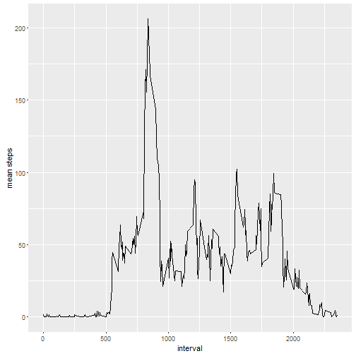
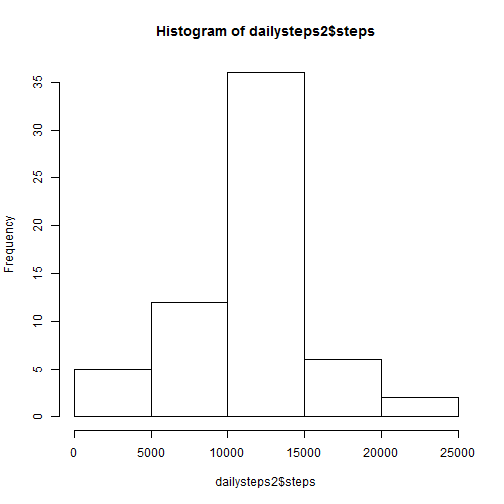
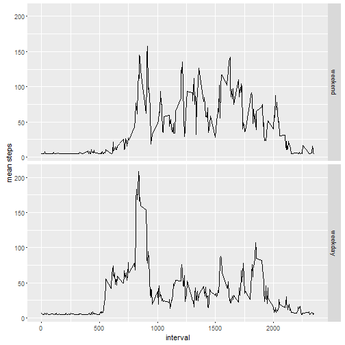

## Loading and preprocessing the data

1. Loading the data and the required packages in R.


```r
library(ggplot2)
library(Hmisc)
data<-read.csv('C:\\Users\\Alina\\Dropbox\\R\\activity.csv')
```
2. Processing the data

```r
data$date<-as.Date(data$date)
```

## What is mean total number of steps taken per day?

1. Total number of steps taken per day

```r
mydata<-data[(complete.cases(data)),]
dailysteps<-aggregate(x=mydata['steps'], FUN=sum, by=list(day=mydata$date))
```

2. Histogram of the total number of steps taken each day


```r
hist(dailysteps$steps)
```


3. The mean and median of the total number of steps taken per day

```r
mean1<-mean(dailysteps$steps)
median1<-median(dailysteps$steps)
```
The mean number of steps taken per day is 1.0766189 &times; 10<sup>4</sup> and the median number of steps taken per day is 10765.

## What is the average daily activity pattern?
1. A time series plot of the 5-minute interval and the average number of steps taken, averaged across all days.


```r
stepsbytime<-aggregate(x=mydata['steps'], FUN=mean, by=list(interval=mydata$interval))
g<-ggplot(stepsbytime, aes(interval, steps)) + geom_line()+
   xlab("interval") + ylab("mean steps")
print(g)
```



2. The maximum number of steps are contained in 1705 minute interval.


## Imputing missing values


```r
missing<-sum(is.na(data$steps))
```
1. The total number of missing values in the dataset are 2304.

2. To fill in the missing values I will be using the mean number of steps for that day. 

3. Creating the new data set with the imputed values.

```r
imputeddata<-data
imputeddata$steps <-impute(imputeddata$steps, fun=mean)
```
4. A histogram of the total number of steps taken each day.

```r
dailysteps2<-aggregate(x=imputeddata['steps'], FUN=sum, by=list(day=imputeddata$date))
hist(dailysteps2$steps)
```



```r
mean2<-mean(dailysteps2$steps)
median2<-median(dailysteps2$steps)
```
The mean of the total number of steps per day is 1.0766189 &times; 10<sup>4</sup> and the median is 1.0766189 &times; 10<sup>4</sup>.

The difference between the mean from the imputed data and the data wihout the missing values is 0 and the difference in the median is -1.1886792. Hence the mean remains the same but the median decreases as a result of imputing.

## Are there differences in activity patterns between weekdays and weekends?

1.  Computing whether a given date is a weekday or weekend day.


```r
weekdays1 <- c('Monday', 'Tuesday', 'Wednesday', 'Thursday', 'Friday')
imputeddata$wDay <- factor((weekdays(imputeddata$date) %in% weekdays1), 
                   levels=c(FALSE, TRUE), labels=c('weekend', 'weekday') )
```
2. A panel plot containing a time series plot of the 5-minute interval (x-axis) and the average number of steps taken, averaged across all weekday days or weekend days (y-axis).


```r
meanbyweekdays<-aggregate(steps~interval+wDay,data=imputeddata, mean)
g2<-ggplot(meanbyweekdays, aes(interval, steps))+geom_line()+
  facet_grid(wDay~.)+
xlab("interval") + ylab("mean steps")
print(g2)
```




